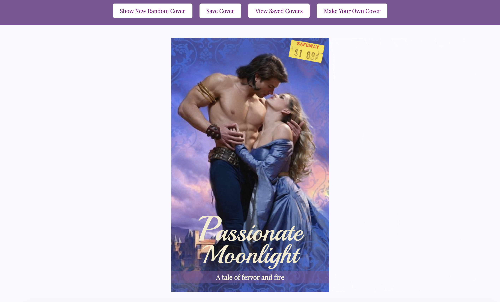
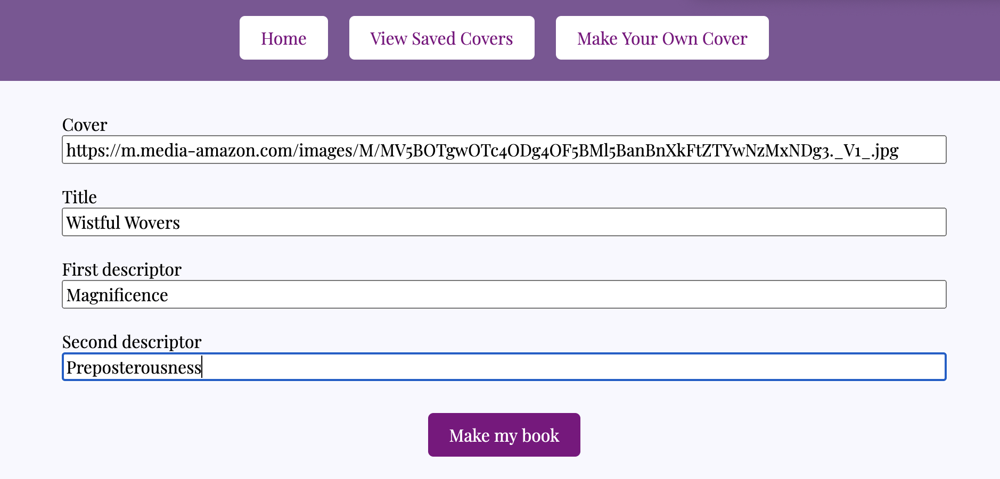

## RomCom - Pair Project

Created by: 

Elle Li: https://github.com/yiranli624
 & 
Daniel Allen: https://github.com/DanielAllen542

Deploy here:  
https://danielallen542.github.io/romcom/

### Intro

Welcome to our Romcom app! Once the website is loaded, on the top the user can see four buttons, "Show new random cover", "Save Cover", "View Saved Covers", and "Make Your Own Cover". Underneath a randomly generated romcom cover with a picture, a title, and two tag-lines can be viewed.
#### Generating new Random Covers
Every time this button is clicked a new cover, with a new picture, a new title, and two new tag-lines will be randomly generated. All of this is displayed in the section below the buttons the same way as the home page view.
#### Making Your Own!
Users have the ability to create a custom romcom cover! Click the "Make Your own cover" button, and fill out the form with a picture address, a title, and two tag-lines of their choice. Once the required fields are met, click the "Make my book" button and arrive back at the home screen with the custom image on display.

 

#### Saving Covers
If the user comes across a cover that they like, they have the option to save it by simply clicking the "Save Cover" button. They can save as many covers as they would like, including the ones that they have made themselves.

Note: The same cover can only be saved once at time.

Every saved Romcom Cover will be displayed in a saved covers section. So that the user can access it by clicking the "View Saved Covers" button. All the covers inside of this display section will be a "mimi" version of what was previously seen.

If the user would like to remove any saved covers then all they have to do is double click on the picture and it will be deleted!

Note: Deleting a cover will allow the user to save that cover once again.
